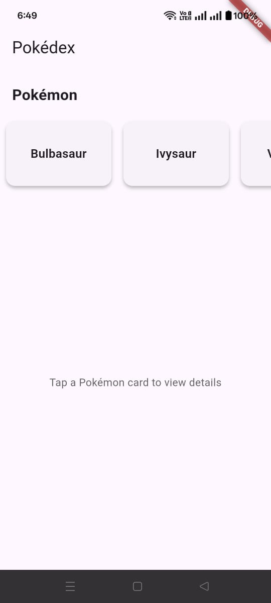
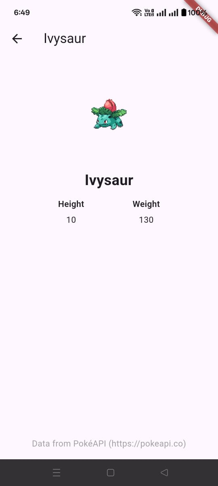

---

```markdown
# Pokédex Flutter App (Intern Task)

## Project Title and Description
A simple Pokédex Flutter application built to demonstrate:  
- Flutter UI  
- BLoC state management (`flutter_bloc`)  
- API integration with the [PokéAPI](https://pokeapi.co/)  

The app has two screens:  
1. **Pokémon List Screen** – Displays a horizontal scrolling list of Pokémon names.  
2. **Pokémon Detail Screen** – Shows Pokémon details (name, height, weight, image).  

---

## Technical Stack
- Flutter (latest stable)  
- Dart  
- flutter_bloc  
- http  
- equatable  

---

## Project Structure / Approach

```

lib/
├── data/
│   ├── models/
│   │   ├── pokemon_detail.dart
│   │   └── pokemon_list_item.dart
│   └── repository/
│       └── pokemon_repository.dart
├── logic/
│   ├── pokemon_detail/
│   │   ├── pokemon_detail_bloc.dart
│   │   ├── pokemon_detail_event.dart
│   │   └── pokemon_detail_state.dart
│   └── pokemon_list/
│       ├── pokemon_list_bloc.dart
│       ├── pokemon_list_event.dart
│       └── pokemon_list_state.dart
├── presentation/
│   ├── screens/
│   │   ├── pokemon_detail_screen.dart
│   │   └── pokemon_list_screen.dart
│   └── widgets/
│       └── pokemon_card.dart
└── main.dart

````

- **Architecture:** Layered architecture using BLoC for state management, separating **UI**, **business logic**, and **data layers**.  
- **BLoCs:** `pokemon_list_bloc` (fetch Pokémon list), `pokemon_detail_bloc` (fetch Pokémon details).  
- **Repositories:** Handle API requests using `http`.  

---

## Generative AI Usage
Used **ChatGPT** for guidance on:  
- Implementing BLoC for API fetching  
- Handling loading, success, and error states in Flutter BLoC  
- Structuring Flutter project with layered architecture  

**Example prompts:**  
- *"How to fetch data from PokéAPI and display in a horizontal list using Flutter BLoC?"*  
- *"Flutter BLoC pattern example for handling API states"*  

---

## How to Run

### Running the App via Flutter (For Developers)

1. Clone the repository:

```bash
git clone https://github.com/Fahmidanishi/pokedex_app_task
````

2. Navigate to the project folder:

```bash
cd pokedex_app_task
```

3. Install dependencies:

```bash
flutter pub get
```

4. Run the app on an emulator or connected device:

```bash
flutter run
```

---

### Installing the Release APK (For Android Users)

1. Download the APK from this link:

[Download Pokédex App APK](https://drive.google.com/file/d/13PZjh_FB0V3n7P4xdwPzpP4cxA4A86h5/view?usp=sharing)

2. Transfer the APK to your Android device (if not downloaded directly).
3. Open the APK file and allow installation from unknown sources if prompted.
4. Install and open the app.

---

### Screenshots

* **Pokémon List Screen:**
  

* **Pokémon Detail Screen:**
  

---

### Notes

* Robust error handling for network failures.
* Loading indicators (`CircularProgressIndicator`) during API fetch.
* Clean and readable code with proper use of `const` and `final`.
* State management implemented using BLoC.

---

## Links

* GitHub Repository: [https://github.com/Fahmidanishi/pokedex_app_task](https://github.com/Fahmidanishi/pokedex_app_task)
* APK Download: [https://drive.google.com/file/d/13PZjh_FB0V3n7P4xdwPzpP4cxA4A86h5/view?usp=sharing](https://drive.google.com/file/d/13PZjh_FB0V3n7P4xdwPzpP4cxA4A86h5/view?usp=sharing)

```


